# GitHub Rich Mermaid Tampermonkey

GitHub の Markdown preview に含まれる Mermaid diagram を、Tampermonkey 内の Docattice-style JavaScript SVG renderer で置き換える userscript。

## Requirements

- Tampermonkey

## Install

1. Tampermonkey の dashboard で new script を作る。
2. `github-docattice-mermaid.user.js` の内容を貼り付ける。
3. GitHub の Markdown / PR / issue preview を開く。

## Supported Renderers

The userscript is self-contained and supports the diagram types used most often in GitHub Markdown previews:

- `C4Context`
- `C4Container`
- `C4Component`
- `erDiagram`
- `journey`
- `flowchart` / `graph`
- `gantt`
- `pie`
- `quadrantChart`
- `requirementDiagram`
- `gitGraph`
- `mindmap`
- `timeline`
- `sequenceDiagram`

## Gallery

### Flowchart

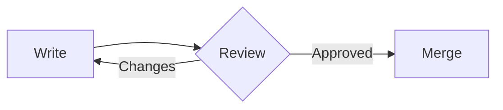

### Sequence Diagram

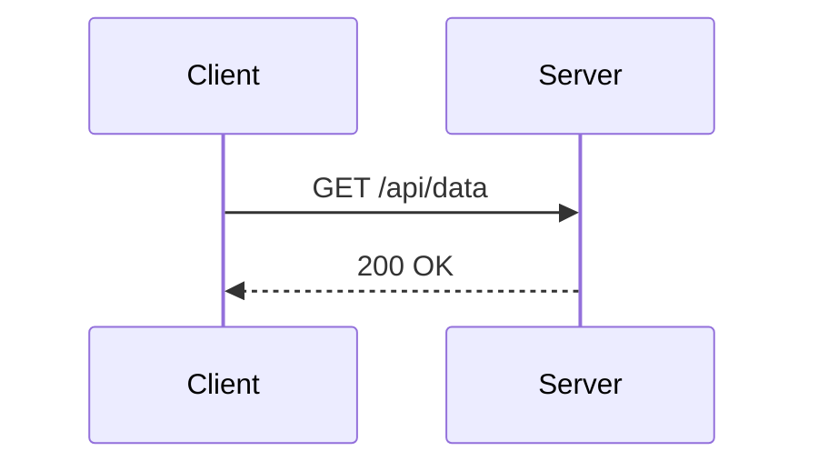

### ER Diagram

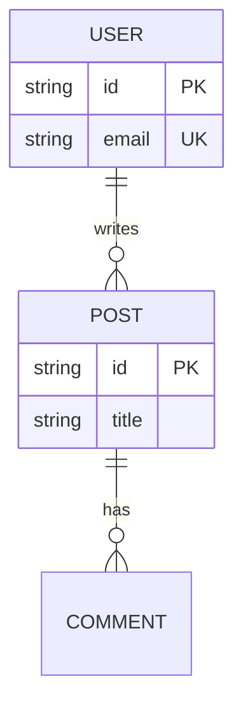

### Journey

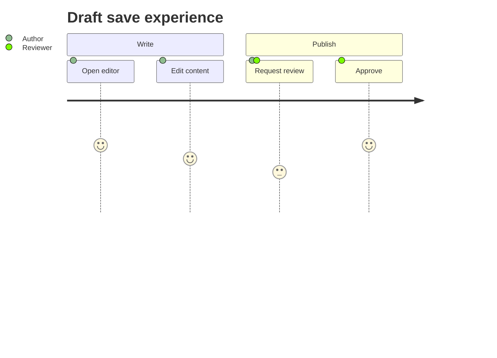

### Gantt

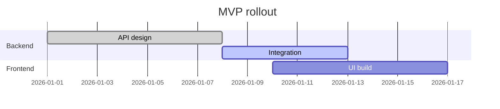

### Pie

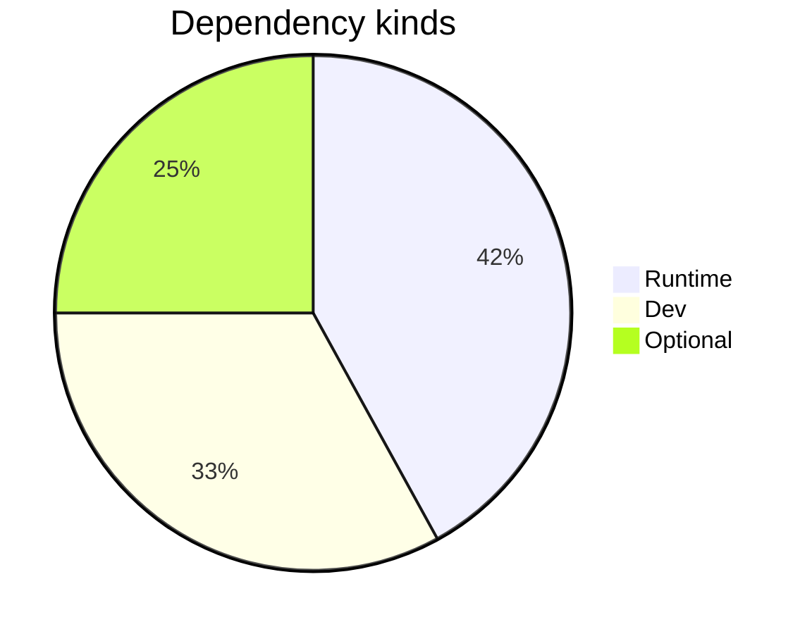

### Quadrant Chart

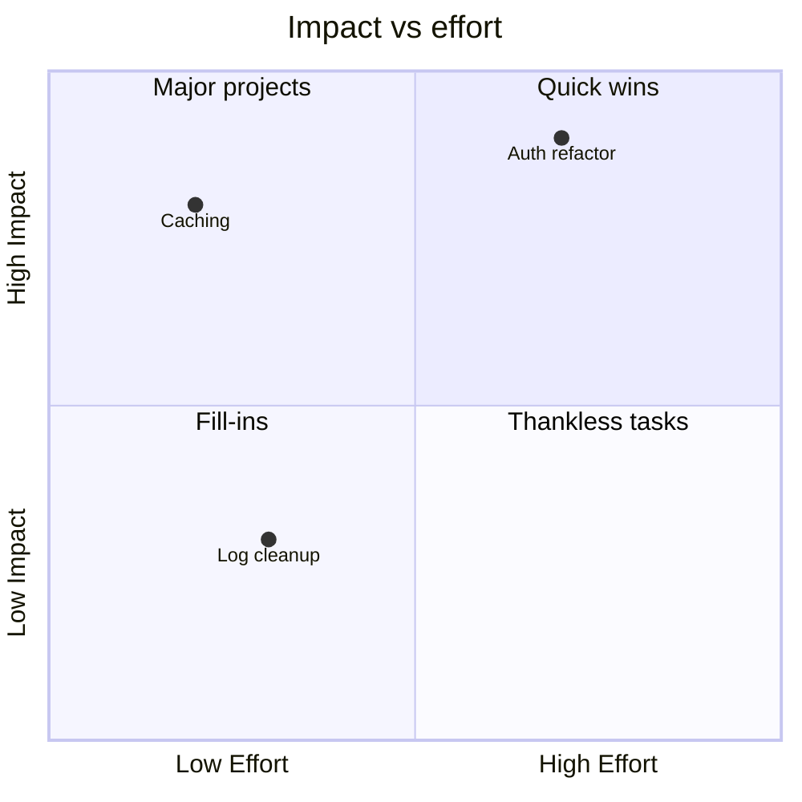

### Requirement Diagram

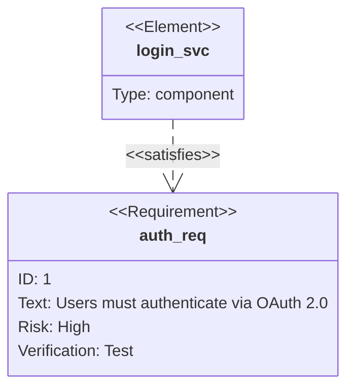

### Git Graph

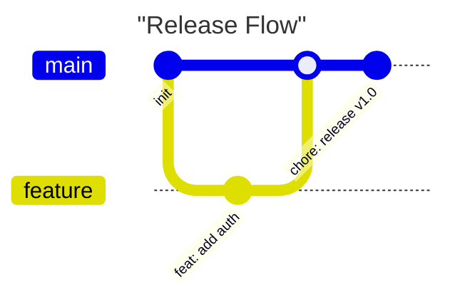

### C4 Container

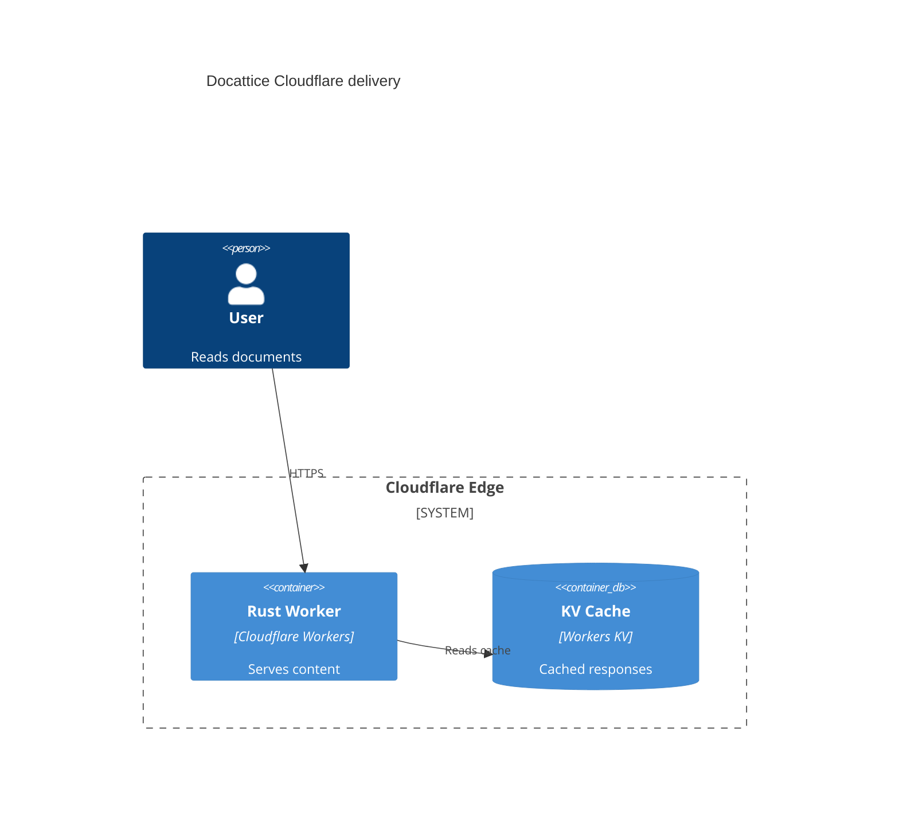

### Mindmap

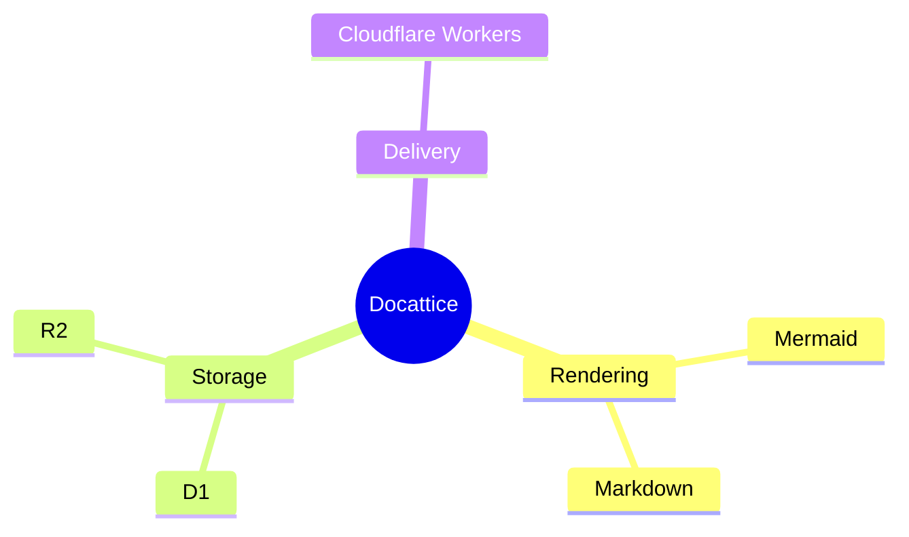

### Timeline

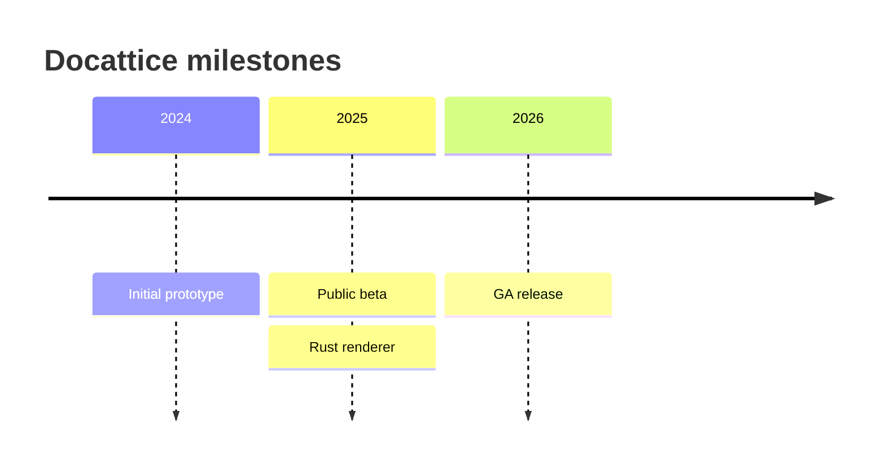

## Notes

- No WASM or Docattice Web server is required.
- GitHub DOM is observed continuously, so diagrams inserted by live preview are enhanced after they appear.
- If Docattice rendering fails, the original GitHub block remains visible with an error caption.
- The C4 renderer ports the Docattice C4 model and scene pipeline for `C4Context`, `C4Container`, and `C4Component`: boundary nesting, node kind/external/data-store handling, directed relation constraints, recursive container measurement, row lane spacing, row crossing reduction, row relaxation, orthogonal routing, label candidate assignment, label lane reservations, boundary crossing lane reservations, scope transition validation, validation issue detection, reroute/relabel repair iterations, C4 icons, and boundary/leaf rendering. The parser still targets common Mermaid/C4 forms, not every Mermaid grammar feature.

## Verify

```bash
node /Users/manji0/src/docattice/extensions/github-mermaid-tampermonkey/verify.js
node /Users/manji0/src/docattice/extensions/github-mermaid-tampermonkey/verify.js --rust-parity
```

The verifier renders the supported gallery diagrams plus regression samples derived from the Rust renderer tests. It checks C4 routing/label validation, label lane reservations, crossing lane reservations, scope transition mismatch detection, repair summary consistency, route detour/bend budgets, canvas waste, deterministic output, same-row spacing, cascade alignment, fan-out alignment, route/node avoidance, parallel lane separation, fan-out anchor ordering, collinear overlap prevention, orthogonal routes, canvas bounds, data attributes, and default C4 titles. It also covers Rust-compatible parser/rendering cases for Flowchart, ER, Journey, Gantt, Pie, Quadrant, Requirement, GitGraph, Mindmap, Timeline, ZenUML, and Sequence quality regressions for GitHub entity-decoded source.

`--rust-parity` builds a temporary Rust helper from the current workspace and compares the JavaScript renderer against `docattice-mermaid-extras` for supported non-sequence samples. It requires `cargo` and checks exact `viewBox`, text-token parity, and large SVG-shape count drift.
