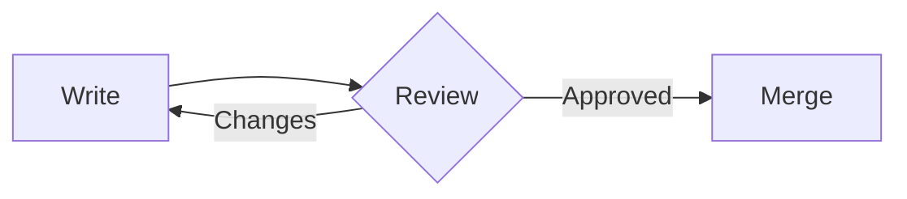
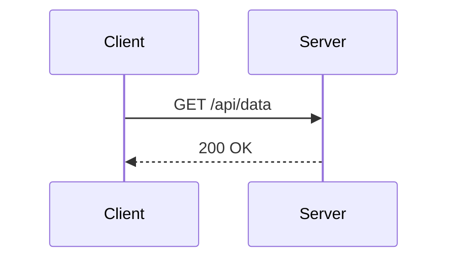
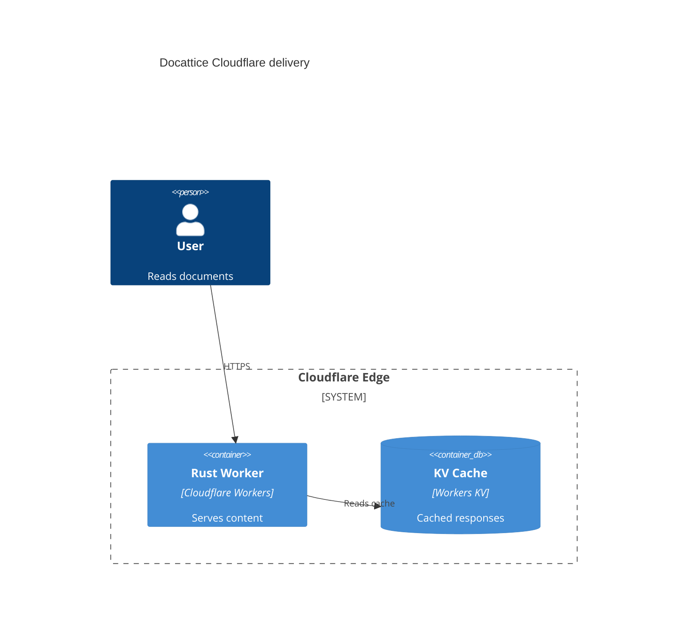

# GitHub Mermaid Rich Renderer

A self-contained Tampermonkey userscript that replaces Mermaid diagrams in GitHub Markdown with rich, deterministic SVG rendering.

It is designed for README files, pull requests, issues, discussions, and GitHub's live Markdown preview. The script runs entirely in the browser: no server, no WASM runtime, and no external renderer process are required.

## Highlights

- Renders many Mermaid diagram families that are useful in technical documentation.
- Includes a C4-aware layout engine for context, container, component, and code diagrams.
- Watches GitHub's dynamic Markdown UI, so diagrams added by preview updates are rendered after they appear.
- Keeps GitHub's original block visible with an error caption if custom rendering fails.
- Uses deterministic SVG output so regressions can be checked in tests.

## Install

1. Install [Tampermonkey](https://www.tampermonkey.net/) for your browser.
2. Open the [raw userscript](https://raw.githubusercontent.com/manji-0/github-rich-mermaid-tampermonkey/main/github-rich-mermaid.user.js).
3. Let Tampermonkey install the script, then refresh a GitHub Markdown page that contains Mermaid diagrams.

The userscript includes Tampermonkey update metadata, so future updates can be picked up from this repository.

## Supported Diagrams

The parser targets common Mermaid syntax used in GitHub-hosted documentation. It is not a complete Mermaid grammar implementation.

C4 and architecture:

- `C4Context`
- `C4Container`
- `C4Component`
- `C4Code`
- `architecture-beta`

Core documentation diagrams:

- `flowchart` / `graph`
- `sequenceDiagram`
- `classDiagram` / `classDiagram-v2`
- `stateDiagram` / `stateDiagram-v2`
- `erDiagram`
- `journey`
- `gantt`
- `pie`
- `quadrantChart`
- `requirementDiagram`
- `gitGraph`
- `mindmap`
- `timeline`
- `zenuml`

Beta and specialized diagrams:

- `block-beta`
- `packet-beta`
- `kanban`
- `sankey` / `sankey-beta`
- `treemap-beta`
- `xychart` / `xychart-beta`
- `radar-beta`
- `venn-beta`

## Examples

### Flowchart



### Sequence Diagram



### C4 Container



## Rendering Algorithm

<!-- derived-from ./docs/rendering-algorithm.md -->

Most diagram types use compact, purpose-built parsers and SVG renderers. C4 diagrams use the full layout pipeline: model parsing, hierarchy-aware measurement, row ordering, orthogonal routing, relation-label placement, validation, and repair.

Read the detailed explanation in [Rendering Algorithm](./docs/rendering-algorithm.md).

For manual flowchart visual QA, open the [Flowchart Gallery](./docs/flowchart-gallery.md).

## Development

The main userscript is [github-rich-mermaid.user.js](./github-rich-mermaid.user.js). The verifier is [verify.js](./verify.js).

Run the regression suite with:

```bash
node verify.js
```

For optional Rust parity checks against the Docattice renderer, run:

```bash
node verify.js --rust-parity
```

The parity mode builds a temporary Rust helper from the current workspace and compares selected non-sequence samples for SVG viewBox, text-token parity, and large shape-count drift. It requires `cargo`.

## Notes

- The script is scoped to `https://github.com/*`.
- Rendering is intentionally conservative: unsupported or failed diagrams fall back to GitHub's original content.
- C4 support is optimized for common Mermaid C4 forms, including nested boundaries, external nodes, data stores, directed relations, lane reservations, and repair metadata.
