# Flowchart Gallery

<!-- derived-from ./rendering-algorithm.md#Public Pipeline -->
<!-- dagayn: discusses-artifact github-rich-mermaid.user.js::renderFlowchart -->
<!-- dagayn: discusses-artifact verify.js::buildFlowchartQualitySamples -->

This gallery is a visual QA page for the userscript flowchart renderer. It intentionally mixes direction, size, shape, labels, loops, fan-out, fan-in, and subgraph cases so regressions are easy to spot by scrolling the rendered GitHub page.

The automated counterpart lives in `verify.js`, where generated samples check clipping, orthogonality, node overlap, label placement, and route/node crossings.

## Direction Samples

### TD Chain

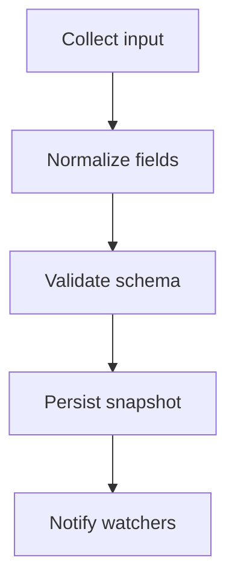

### LR Chain

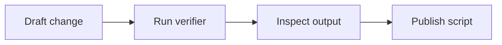

### BT Chain

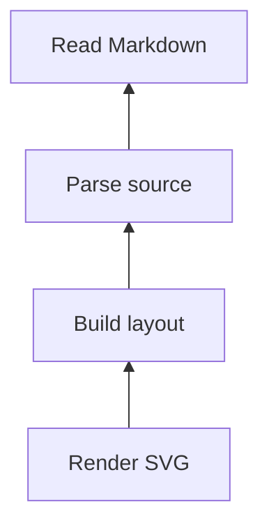

### RL Chain

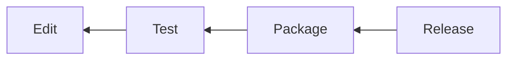

## Branching

### Decision Split and Merge

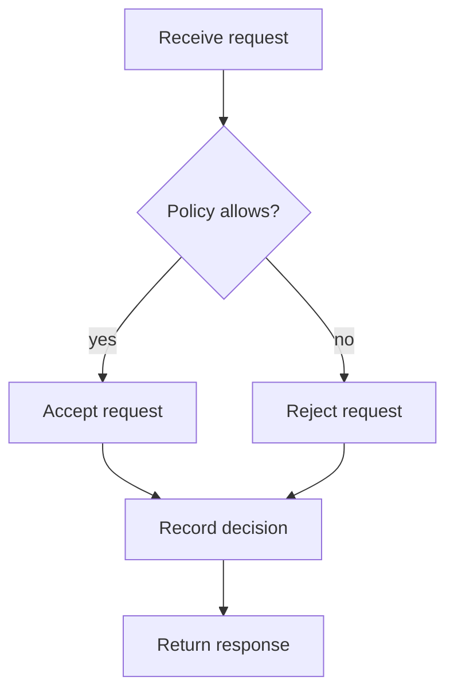

### Wide Fan-out and Fan-in

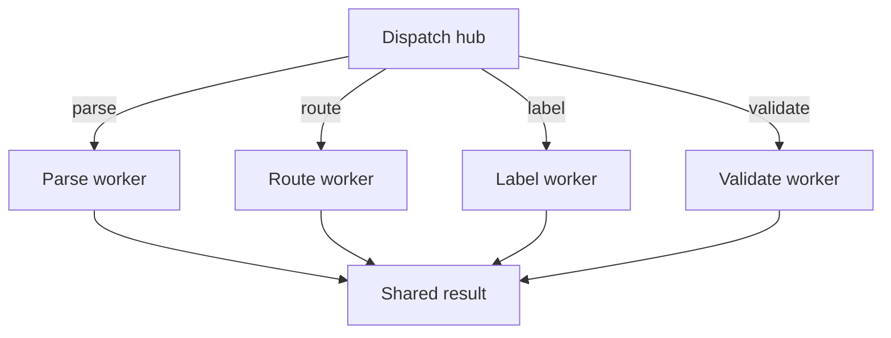

### Uneven Branch Depth

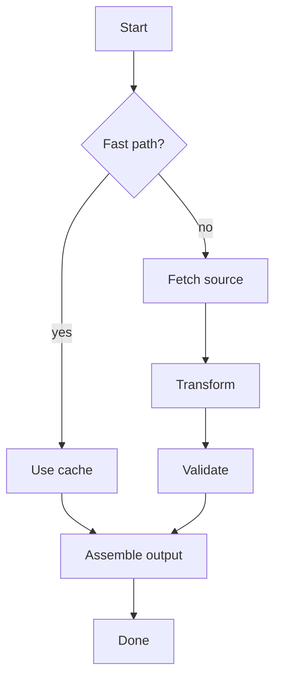

## Loops

### Review Loop

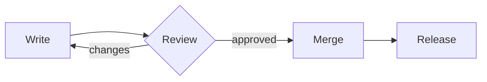

### Audit Retry Loop

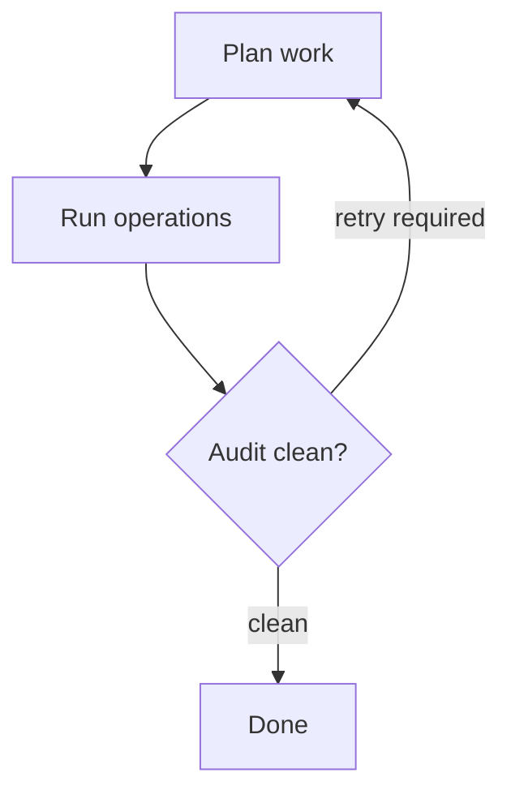

### Nested Retry Loop

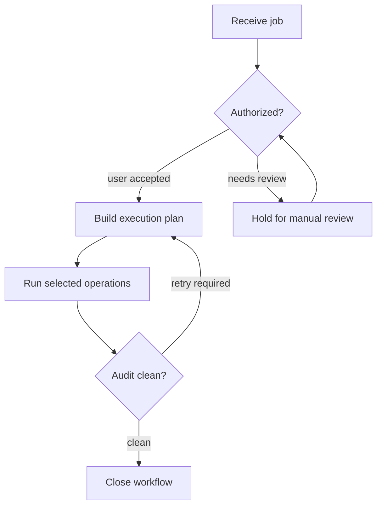

## Labels

### Short Labels

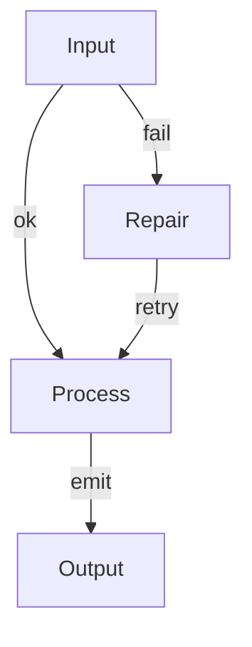

### Long Labels

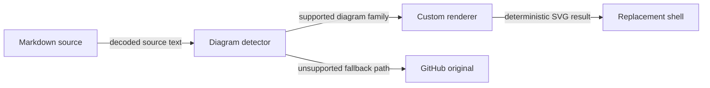

### Mixed Edge Styles

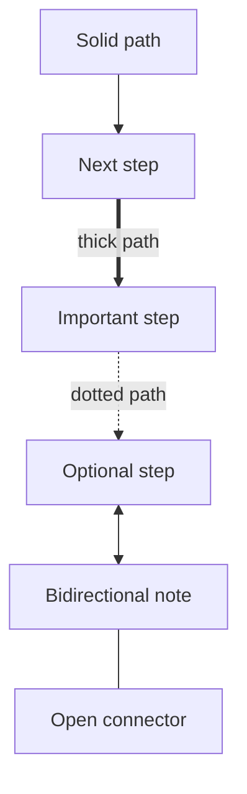

## Shapes

### Basic Shapes

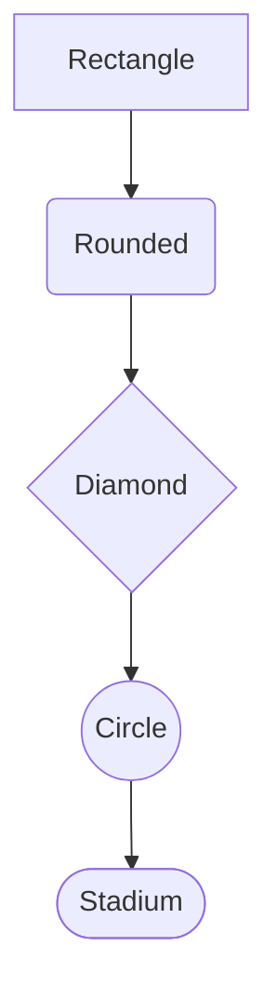

### Data and Worker Shapes

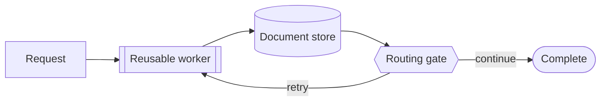

### Skewed Shapes

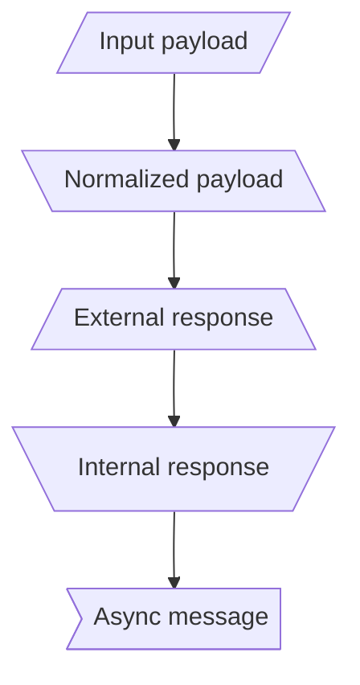

## Subgraphs

### Simple Subgraph

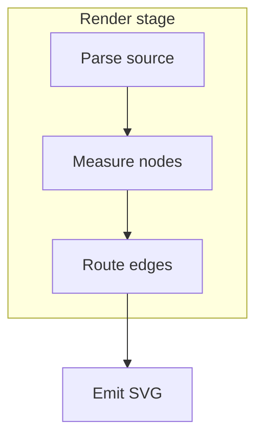

### Subgraph With Local Direction

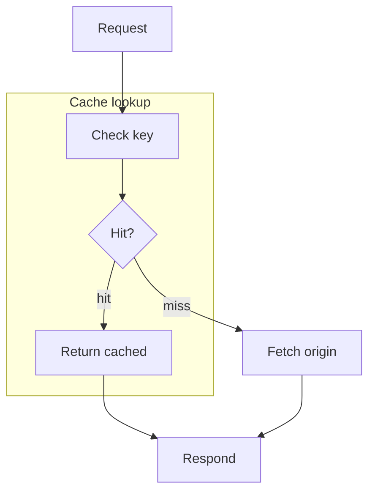

### Multiple Subgraphs

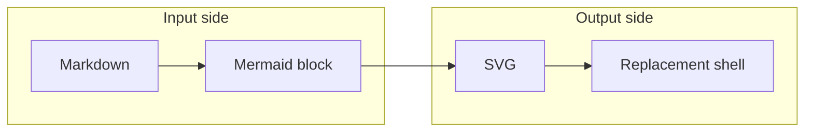

## Larger Workflows

### Public Pipeline

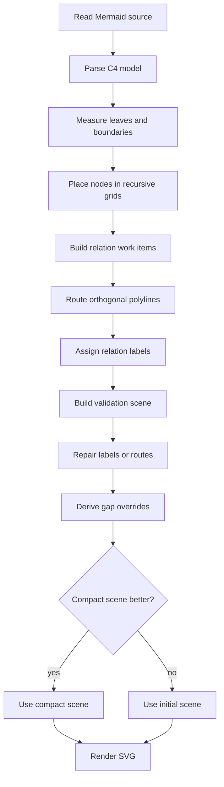

### CI Workflow

```mermaid
flowchart LR
  A[Push branch] --> B[Install dependencies]
  B --> C[Run syntax checks]
  C --> D[Run gallery verification]
  D --> E{All checks pass?}
  E -- yes --> F[Ready to merge]
  E -- no --> G[Inspect failure]
  G --> H[Patch renderer]
  H --> D
```

### Document Publishing

```mermaid
flowchart TD
  A[Author Markdown] --> B[Preview on GitHub]
  B --> C{Diagram readable?}
  C -- yes --> D[Publish document]
  C -- clipped --> E[Adjust renderer]
  C -- crowded --> F[Improve routing]
  E --> B
  F --> B
```

## Dense Cases

### Dense Fan-out

```mermaid
flowchart TD
  A[Hub] -- alpha --> B[Alpha]
  A -- beta --> C[Beta]
  A -- gamma --> D[Gamma]
  A -- delta --> E[Delta]
  A -- epsilon --> F[Epsilon]
  B --> G[Sink]
  C --> G
  D --> G
  E --> G
  F --> G
```

### Crossing Pressure

```mermaid
flowchart TD
  A[Source A] --> D[Target D]
  B[Source B] --> E[Target E]
  C[Source C] --> F[Target F]
  A --> E
  B --> F
  C --> D
```

### Label Pressure

```mermaid
flowchart LR
  A[Input stream] -- parse and normalize source text --> B[Parser]
  B -- classify diagram family and direction --> C[Layout]
  C -- route orthogonal paths around node bodies --> D[Router]
  D -- place readable edge labels outside nodes --> E[Labeler]
  E -- produce deterministic SVG for GitHub --> F[Output]
```

## Summary

<!-- derived-from #direction-samples -->
<!-- derived-from #branching -->
<!-- derived-from #loops -->
<!-- derived-from #labels -->
<!-- derived-from #shapes -->
<!-- derived-from #subgraphs -->
<!-- derived-from #larger-workflows -->
<!-- derived-from #dense-cases -->

Use this page after renderer changes to scan for clipping, overlapping nodes, label collisions, route crossings through node bodies, and overly compressed layouts.
