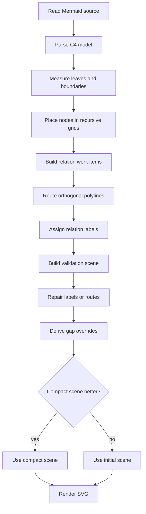

# Rendering Algorithm

This document explains how GitHub Mermaid Rich Renderer turns Mermaid source found in GitHub Markdown into deterministic SVG. It focuses on the C4 renderer because that is the most algorithmically interesting part of the userscript: C4 diagrams combine directed graph layout, nested boundaries, typed architecture nodes, orthogonal routing, edge labels, validation, and local repair.

Most other Mermaid families in this repository are rendered with compact, diagram-specific parsers and direct layout rules. C4 diagrams require a larger pipeline because the renderer must preserve architectural meaning while still producing a readable picture in a constrained browser userscript.

## Scope and Constraints

<!-- dagayn: discusses-artifact github-rich-mermaid.user.js::renderC4Component -->

The renderer is intentionally domain-specific. It does not try to implement all of Mermaid or to expose a general graph layout engine. It optimizes for the diagrams engineers actually put in GitHub README files, pull requests, and issues.

The main constraints are:

- The renderer must run in a Tampermonkey userscript.
- It cannot depend on a remote service.
- It cannot rely on a WASM bundle or a large embedded layout engine.
- It must keep GitHub's original diagram block available when rendering fails.
- It must produce stable SVG so the verification script can compare output deterministically.
- It should improve the readability of C4 diagrams without requiring authors to annotate layout hints.

The last point matters most. C4 diagrams are usually written as a semantic model: people, systems, containers, components, data stores, and relations. Authors normally do not want to specify exact coordinates. The renderer therefore treats Mermaid C4 source as a constraint graph and derives layout from relation direction, nesting, node kind, and label pressure.

## Why C4 Is Harder Than Basic Mermaid

Mermaid flowcharts and sequence diagrams are mostly flat. A flowchart has nodes and edges; a sequence diagram has participants and messages. C4 diagrams add three sources of difficulty.

First, C4 diagrams are compound graphs. Boundary nodes contain other nodes. A `System_Boundary` can contain containers, and a `Container_Boundary` can contain components. A relation can connect two nodes inside the same boundary, cross from an inner boundary to an outer node, or cross multiple nested boundaries.

Second, C4 node kinds carry layout semantics. A person is not the same kind of object as a database. External systems should often sit near the outside of the diagram, and data stores often read better below services. These are not graph-theory rules, but they are useful architectural conventions.

Third, relation labels are part of the diagram. A route that looks clean without its label may become unreadable once "Reads cache (Redis)" or "Publishes events (Kafka)" has to fit next to the line. The renderer therefore cannot treat labels as a final decorative pass only. Labels feed back into gap budgeting, validation, and local repair.

## Background: Layered Drawing

The C4 layout is loosely based on layered graph drawing. In a classic layered layout, the drawing problem is split into phases:

1. Assign nodes to ranks.
2. Order nodes within each rank.
3. Assign coordinates.
4. Route edges between the coordinates.

That family of algorithms is often associated with the Sugiyama framework and with practical descendants such as Graphviz `dot`. This renderer borrows the same separation of concerns, but it is simpler and more specialized:

- It uses C4 relation directions as ranking constraints.
- It uses local boundary grids instead of one global graph.
- It uses deterministic heuristics instead of expensive global optimization.
- It treats labels and boundary crossings as first-class quality signals.

A small example shows the shape of the problem:

```text
Rel_D(api, service, "Calls")
Rel_D(service, db, "Reads")
Rel_R(api, cache, "Reads warm data")
```

The downward relations imply vertical ranks. The rightward relation implies horizontal order. The database kind adds another weak hint that `db` should sit below non-store services. The final layout is not just "topological sort"; it is a compromise between directional constraints, row order, gap budgets, route corridors, and label placement.

## Compound Graph Model

C4 boundaries make the graph hierarchical. The parser represents this as a tree:

```text
root
  user
  platform
    api
    core
      timeline
      fanout
      graph
    postdb
```

Relations remain edges between concrete node ids:

```text
user -> api
api -> timeline
timeline -> graph
timeline -> postdb
```

When the renderer lays out `platform`, it only needs to place the immediate children of `platform`: `api`, `core`, and `postdb`. The internals of `core` are measured recursively and treated as a single box at the parent level. This is the key simplification. Instead of solving one global compound graph, each boundary owns a local grid, and parent grids compose child grids.

This approach is not as general as a full compound layout engine with hierarchical ports, but it fits C4 diagrams well:

- Boundaries usually express ownership, not arbitrary graph clusters.
- Most relations follow a small set of directions.
- Diagrams are small enough that deterministic local heuristics are easier to tune than a general solver.
- Browser-side rendering benefits from predictable work and small code size.

## Public Pipeline

<!-- dagayn: discusses-artifact github-rich-mermaid.user.js::selectC4ValidatedScene -->

At the C4 entry point, the renderer performs a staged pipeline:



The code-level shape is:

```text
renderC4Component
  parseC4Model
  selectC4ValidatedScene
    buildC4ValidatedScene
      layoutC4Scene
      c4BuildWorkItems
      c4AssignLabels
      c4RepairWorkItems
      c4BuildValidationScene
      c4ValidateScene
      c4SceneQuality
    c4DeriveGapOverrides
    buildC4ValidatedScene
    c4SceneCandidateBetter
  renderC4Node
  renderC4RelationLabel
```

The rest of this document walks through those phases in more detail.

## Flowchart Routing Contract

<!-- dagayn: discusses-artifact github-rich-mermaid.user.js::flowchartSideForBoxes -->
<!-- dagayn: discusses-artifact verify.js::assertFlowchartQualitySample -->

Flowcharts use a smaller renderer than C4, but their routing still follows an explicit quality contract. The contract exists so readability bugs can be tested as renderer behavior rather than judged by screenshots alone.

### Port Rules

For normal forward edges, the diagram direction decides the exit and entry sides:

| Direction | Forward edge |
| --- | --- |
| `TD` | source bottom to target top |
| `BT` | source top to target bottom |
| `LR` | source right to target left |
| `RL` | source left to target right |

Back edges use the opposite sides. Same-rank or cross-rank edges may use the perpendicular sides, but rerouting must not move the chosen start or end port after the port rule has been selected. A decision diamond has one extra constraint: an outgoing branch must not reuse a side that already carries an incoming edge into that same decision. When a back branch would otherwise exit from the incoming side, it is moved to a perpendicular side so the loop reads as leaving the decision instead of reversing through its entry port. Return edges also avoid entering a target through the same side that the target already uses for outgoing flow, which prevents a loop from visually riding on top of the forward edge.

### Line Quality Rules

Flowchart routes are orthogonal polylines. The renderer should preserve these line rules:

- Routes must not cross non-endpoint node bodies.
- Unrelated edges must not cross each other.
- Edges that share a source or target may cross only inside a constrained fan zone, and only within a small crossing budget.
- Collinear line overlap is treated as a defect. Unrelated edges have a zero-pixel overlap budget; shared-endpoint edges have only a short local overlap budget.
- A route may detour to avoid nodes or line conflicts, but its perpendicular span must stay close to the source-target corridor. Wide loops around unrelated parts of the canvas are invalid.
- Mixed-side routes keep their selected ports and add detour lanes from both node obstacles and already routed line segments before choosing the lowest-penalty path.
- Labels are placed after routing and must remain inside the viewport without overlapping node bodies.

The verification script checks these rules across the generated flowchart quality sample set. Individual dense samples can carry explicit budgets, but the default policy is intentionally strict: unrelated crossings are zero, unrelated overlap is zero, and route span overflow is capped.

## Phase 0: GitHub Source Discovery

The userscript runs on `https://github.com/*` and has to deal with several GitHub Markdown states:

- already-rendered Mermaid blocks,
- live preview blocks,
- raw Markdown loaded from the page,
- GitHub enrichment wrappers,
- HTML-entity-decoded source,
- headings that GitHub uses to identify some unsupported diagrams.

Before a diagram reaches the C4 renderer, the userscript extracts a source string and checks the first meaningful Mermaid line to determine the diagram type. Supported C4 types are `C4Context`, `C4Container`, `C4Component`, and `C4Code`.

This phase is deliberately conservative. If the userscript cannot confidently recover the original Mermaid source, it does not destroy the GitHub-rendered block. Rendering is an enhancement, not a replacement that can make content disappear.

## Phase 1: Parse C4 Source

<!-- dagayn: discusses-artifact github-rich-mermaid.user.js::parseC4Model -->

The C4 parser is line-oriented and targets the common Mermaid C4 function-call style. It is not a complete Mermaid grammar. That tradeoff keeps the userscript small and makes the accepted input surface easy to reason about.

For each non-empty, non-comment line after the diagram type, the parser recognizes one of four cases.

### Title

```mermaid
C4Container
  title Docattice Cloudflare delivery
```

The title becomes the SVG title and the default accessibility label. If no title is present, the renderer uses a diagram-type default such as `C4 Container`.

### Boundary Calls

```mermaid
System_Boundary(edge, "Cloudflare Edge") {
  Container(worker, "Rust Worker", "Cloudflare Workers", "Serves content")
}
```

Boundary calls are normalized to internal kinds:

| Mermaid call | Internal kind |
| --- | --- |
| `Enterprise_Boundary` | `EnterpriseBoundary` |
| `System_Boundary` | `SystemBoundary` |
| `Container_Boundary` | `ContainerBoundary` |

The parser keeps a boundary stack. When it sees a boundary open, the new boundary id is pushed. When it sees `}`, the top boundary is popped. Any node parsed while a boundary is on the stack receives the top boundary as its parent.

### Node Calls

```mermaid
Person_Ext(user, "User", "Reads documents")
ContainerDb(kv, "KV Cache", "Workers KV", "Cached responses")
```

Node calls are normalized into:

- `Person`
- `System`
- `SystemDb`
- `Container`
- `ContainerDb`
- `Component`
- `ComponentDb`

The `_Ext` suffix marks a node as external but keeps the base kind. For example, `System_Ext` becomes a `System` node with `external: true`.

The parser stores:

- `id`
- `label`
- `technology`
- `detail`
- `parent`
- `external`
- `kind`
- `children`

`technology` and `detail` follow Mermaid C4's loose argument convention. With four arguments, the third argument is technology and the fourth is detail. With three arguments, the third argument is treated as detail.

### Relation Calls

```mermaid
Rel_R(user, worker, "HTTPS")
Rel_D(worker, kv, "Reads cache")
```

Directed relation calls become internal directions:

| Mermaid call | Direction |
| --- | --- |
| `Rel_R` | `right` |
| `Rel_L` | `left` |
| `Rel_D` | `down` |
| `Rel_U` | `up` |
| `Rel` | inferred later from geometry |

The relation stores `from`, `to`, `label`, `technology`, `direction`, and the original tag. The display label is later normalized to `label` or `label (technology)`.

## Phase 2: Measure Nodes

<!-- dagayn: discusses-artifact github-rich-mermaid.user.js::measureC4Node -->

Layout depends on measured sizes. The renderer measures leaves first and boundaries recursively.

### Leaf Measurement

<!-- dagayn: discusses-artifact github-rich-mermaid.user.js::measureC4Leaf -->

Leaf cards have a fixed width of 240 pixels. Height depends on node kind and wrapped text:

- people start slightly shorter,
- data stores get more vertical room,
- components are compact,
- title, technology, and detail lines can add height.

Text width is estimated with a simple character model rather than actual browser measurement. The goal is not typographic perfection. The goal is deterministic sizing that is stable in test and close enough for GitHub's font stack.

Important constants are collected in the `C4` object:

| Constant | Purpose |
| --- | --- |
| `rootPadX`, `rootPadY` | Outer diagram padding |
| `containerPadX`, `containerPadY` | Boundary content padding |
| `containerHeaderH` | Reserved boundary header height |
| `rowGap`, `colGap` | Base spacing between rows and columns |
| `minInlineRelGap`, `maxInlineRelGap` | Bounds for same-row relation gaps |
| `rowLanePitch` | Vertical distance between same-row route lanes |
| `inlineLabelWrapW` | Label wrapping width for inline relations |
| `maxRelaxShiftX` | Maximum horizontal shift during row relaxation |

### Boundary Measurement

Boundaries are not measured from their text alone. A boundary is measured by laying out its children first.

The process is recursive:

1. Measure each child.
2. Build a local grid for the boundary's immediate children.
3. Add horizontal padding, header height, and vertical padding.
4. Store a boundary anchor for external horizontal relations.

The anchor is subtle. When a boundary connects horizontally to something outside, the renderer wants the edge to enter near the relevant internal content instead of always entering the geometric center. If child relations suggest a better y-position, the boundary anchor uses those child positions. Otherwise it falls back to a non-data-store child or the first child.

This is why a boundary can behave like a single node at the parent level while still exposing a useful connection point derived from its internals.

## Phase 3: Build Local Grids

<!-- dagayn: discusses-artifact github-rich-mermaid.user.js::buildC4Grid -->

Each boundary, including the implicit root, gets a local grid. The grid builder only places immediate children of the current parent. A nested boundary is already measured and participates as one box.

### Constraint Extraction

<!-- dagayn: discusses-artifact github-rich-mermaid.user.js::collectC4Constraints -->

The renderer extracts horizontal and vertical constraints from relations that are visible at the current parent level. For a relation between two deeply nested nodes, it finds the immediate child of the current parent that contains each endpoint. This is what lets a relation inside `core` influence the layout of `core`, while a relation from `api` to a child of `core` can influence the layout of `platform`.

Direction hints become constraints:

| Relation direction | Constraint |
| --- | --- |
| `right` | source before target on x-axis |
| `left` | target before source on x-axis |
| `down` | source before target on y-axis |
| `up` | target before source on y-axis |

Undirected `Rel` calls get weak semantic constraints:

- external nodes tend to appear before internal nodes,
- non-store nodes tend to appear above data stores,
- store-to-non-store edges are inverted so stores sink lower.

Additional node-kind heuristics also apply across siblings:

- data stores are biased below non-stores,
- external nodes are biased outside boundaries,
- people are biased before external systems when both appear at the same level.

The result is not a mathematically optimal graph. It is a set of stable, readable conventions tuned for architecture diagrams.

### Rank Solving

<!-- dagayn: discusses-artifact github-rich-mermaid.user.js::solveRankConstraints -->

`solveRankConstraints` treats constraints as a directed acyclic ordering problem. It builds adjacency and indegree maps, then runs a Kahn-style topological traversal. Each time an edge `A -> B` is processed, `B` receives at least `rank(A) + 1`.

If contradictory input creates a cycle, the function does not throw. Any unvisited nodes fall back to rank 0. That keeps the renderer usable for imperfect hand-written diagrams. The output may be less ideal, but it remains deterministic.

### Row Assembly

<!-- dagayn: discusses-artifact github-rich-mermaid.user.js::groupRowsByRank -->

Vertical ranks become rows. Within each row, nodes are first sorted by horizontal rank, then by C4 node weight, then by id. This gives a predictable baseline before crossing minimization.

The node weight is a small domain heuristic:

- external nodes have low weight,
- people are light,
- regular systems/components are medium,
- data stores are heavier.

This weight affects tie-breaking, not hard placement.

## Phase 4: Crossing Reduction and Corridor Hints

<!-- dagayn: discusses-artifact github-rich-mermaid.user.js::optimizeRowOrderWithCorridorHints -->

Plain row sorting is not enough for multi-row relations. A relation from row 0 to row 3 can cross many things in between. The renderer therefore uses a crossing-reduction pass with temporary virtual nodes.

### Long Edges Become Virtual Nodes

<!-- dagayn: discusses-artifact github-rich-mermaid.user.js::expandLongEdgesWithVirtualNodes -->

For relations that span multiple ranks, the renderer inserts virtual nodes into intermediate rows. These virtual nodes do not render. They exist only so row-order optimization can "feel" the path a long relation wants to take.

For example:

```text
row 0: api
row 1: __virtual_relation_7_1
row 2: __virtual_relation_7_2
row 3: db
```

The virtual nodes receive desired order positions interpolated between source and target. After optimization, they are removed from the real rows, but their final positions are converted into corridor hints.

### Barycenter Sweeps

The optimizer performs downward and upward sweeps. During a sweep, each node gets a barycenter computed from connected nodes in already-considered rows. A local row optimizer then tries to improve order while respecting x-rank buckets.

The implementation avoids unconstrained row shuffling. Nodes with different hard x-ranks are not freely swapped. This preserves direction hints while still allowing useful local improvements.

### Corridor Hints

<!-- dagayn: discusses-artifact github-rich-mermaid.user.js::extractCorridorHints -->

After virtual-node optimization, the renderer extracts corridor hints. A hint says, in effect:

```text
relation N wants to pass through row R between neighbor L and neighbor R
```

Those hints are later used by horizontal relaxation. They give long edges a weak claim on horizontal space without forcing explicit edge paths during placement.

This is a practical compromise between two extremes:

- ignoring long edges until routing, which often causes avoidable detours,
- solving placement and routing jointly, which is much more complex.

## Phase 5: Gap Budgeting and Row Placement

<!-- dagayn: discusses-artifact github-rich-mermaid.user.js::c4DeriveGapOverrides -->

Once rows are ordered, the renderer computes how much horizontal and vertical space each row needs.

### Same-Row Relation Gaps

Same-row horizontal relations need horizontal gaps between neighboring nodes. A short relation between adjacent nodes may need enough room for a label. A relation spanning several nodes may need a lane above or below the row.

For each row gap, the renderer considers:

- base column gap,
- number of relation segments crossing that gap,
- estimated label width,
- peer pressure from shared sources or shared targets,
- gap overrides learned from an earlier routing pass.

The bounds are intentionally clamped. Gaps should expand enough to fit relation labels, but not so much that the diagram becomes mostly empty space.

### Row Lane Heights

Spanning same-row relations reserve vertical lanes. The renderer uses an interval-style allocation: if two spanning relations overlap, they need separate lanes; if they do not overlap, they can reuse a lane.

The lane height is derived from:

- number of effective lanes,
- label line count,
- congestion through row gaps,
- `minRowLaneH` and `maxRowLaneH`.

This is why a row with several horizontal relations can grow vertically even before routing starts. It creates a channel for the later orthogonal polylines.

### Coordinate Assignment

The grid then assigns concrete positions:

1. Compute natural row width from child widths and gaps.
2. Set content width to the maximum row width.
3. Center each row within that width.
4. Align each child by row anchor.
5. Add row lane height and row gap before the next rank.

At this point the layout is legal but still a little stiff. The next step relaxes x-positions.

### Row Relaxation

<!-- dagayn: discusses-artifact github-rich-mermaid.user.js::relaxRowPositionsWithCorridorHints -->

Row relaxation nudges nodes toward connected peers. For each node, the algorithm samples:

- its original center,
- centers of connected nodes,
- corridor hint target centers.

It uses a weighted median-like target, clamps movement by `maxRelaxShiftX`, blends toward the target, and then legalizes the row so nodes do not overlap or leave the content width.

The important property is that relaxation is bounded. It improves alignment but cannot completely undo the rank/order decisions. That keeps the output stable and prevents a single relation from dragging a row into an unexpected arrangement.

## Phase 6: Recursive Scene Layout

<!-- dagayn: discusses-artifact github-rich-mermaid.user.js::layoutC4Scene -->

After each local grid is built, `layoutC4Scene` converts relative grid positions into absolute scene coordinates.

The root grid starts at `rootPadX` and `rootPadY`. Each boundary child receives an absolute box. If that child is itself a boundary, `layoutC4Node` recursively places its children inside:

```text
child absolute x = boundary x + containerPadX + child local x
child absolute y = boundary y + headerH + containerPadY + child local y
```

The scene stores a `layouts` map from node id to absolute box:

```text
id -> { x, y, w, h, headerH }
```

This absolute map is the input for routing, validation, and SVG rendering.

## Phase 7: Relation Work Items

<!-- dagayn: discusses-artifact github-rich-mermaid.user.js::c4BuildWorkItems -->

Routing is organized around relation work items. A work item is a mutable record for one relation:

```text
{
  relationIndex,
  rel,
  displayLabel,
  allowedRegion,
  route,
  pathLength,
  manhattanSpan,
  routingState,
  labelPlacement,
  crossingReservations,
  sourcePortOffset,
  targetPortOffset,
  routeHints
}
```

This structure lets the renderer route greedily, then revisit individual relations during label repair without rebuilding the whole scene.

### Allowed Regions

<!-- dagayn: discusses-artifact github-rich-mermaid.user.js::c4RelationAllowedRegion -->

The allowed region limits where a route may place points.

If a relation's endpoints share a common boundary ancestor, the route is constrained to that boundary's content area. Otherwise it can use the canvas. This prevents an internal relation from escaping the boundary just because a detour axis outside the boundary would be shorter.

### Obstacles

<!-- dagayn: discusses-artifact github-rich-mermaid.user.js::c4RelationObstacles -->

Obstacle construction distinguishes between:

- source and target node bodies, which the route may touch at ports,
- unrelated node bodies, which should be avoided,
- boundary headers, which should not be crossed unless the relation actually crosses that boundary,
- unrelated boundaries, which can be inflated into obstacles.

This distinction is important. A relation crossing a boundary must be allowed to pass through the boundary wall, but it should not cut through a boundary title header as if that header were empty canvas.

### Port Offsets

Fan-out and fan-in groups receive small source or target port offsets. For example, three `Rel_D` arrows leaving the same component are spread across the bottom edge instead of all using the exact center.

The ordering for fan-out is based on target center. The ordering for fan-in is based on source center and a direction-specific tie-break. This is what keeps incoming arrows ordered consistently when several upstream nodes connect to the same data store or service.

For some vertical fan-in cases, target port offset preservation is enabled. That prevents the router from snapping the target port back to a straight alignment when the offset is the thing that keeps ports ordered.

### Relation Priority

<!-- dagayn: discusses-artifact github-rich-mermaid.user.js::c4RelationPriorityScore -->

Relations are routed in priority order. The priority score combines:

- center-to-center span,
- explicit direction weight,
- label length,
- boundary crossing count,
- data-store involvement,
- relation index as a deterministic tie-break.

Higher-priority relations reserve route segments earlier. This greedy strategy is not globally optimal, but it works well when paired with later validation and local repair.

## Phase 8: Orthogonal Routing

<!-- dagayn: discusses-artifact github-rich-mermaid.user.js::routeC4Relation -->

The router uses orthogonal polylines: horizontal and vertical segments only. It starts by resolving the source and target sides.

Explicit relation directions choose sides directly:

| Direction | Source side | Target side |
| --- | --- | --- |
| `right` | right | left |
| `left` | left | right |
| `down` | bottom | top |
| `up` | top | bottom |

Undirected relations fall back to geometry-based side selection.

### Stubs

The route leaves each node through a short stub. Stubs keep arrowheads from immediately bending at a node border and give labels and intersections more room.

For a downward relation, the route starts at the bottom anchor and extends downward before any horizontal detour. For a rightward relation, it starts at the right anchor and extends rightward before any vertical detour.

### Candidate Axes

The router enumerates candidate axes instead of running a full grid search. For vertical-ish routes, it tries x-axes such as:

- source x,
- target x,
- midpoint x,
- source center,
- target center,
- outside edges of source and target boxes,
- allowed-region edges,
- obstacle edges plus margin,
- route-hint vertical axes,
- axes shifted away from already occupied vertical segments.

For horizontal-ish routes, it performs the analogous search over y-axes.

For each axis, the router enumerates turn positions near source and target stubs. Each candidate is simplified to remove redundant points and tiny zigzags.

### Candidate Scoring

Each candidate route receives a score:

```text
path length
+ bend count penalty
+ obstacle penalty
+ occupied-segment overlap penalty
+ occupied-segment crossing penalty
+ short-label-segment penalty
+ route-hint bias
```

Obstacle and overlap penalties are intentionally huge. Length and bend count only decide among otherwise acceptable candidates. Route hints can bias a candidate lower when it follows a useful boundary-crossing or same-scope axis.

### Fallback Route

The router always adds a simple fallback orthogonal route. It may not be as attractive as a scored candidate, but it keeps relations visible when the preferred candidates are blocked.

This differs from a heavier layout engine that might build a discrete grid and run Dijkstra or A*. The userscript version deliberately stays with enumerated candidate axes plus fallback routing. That is smaller, deterministic, and sufficient for the diagram sizes this project targets.

## Phase 9: Boundary Crossing Reservations

<!-- dagayn: discusses-artifact github-rich-mermaid.user.js::c4BuildRelationCrossingReservations -->

Nested boundaries introduce a special validation problem: it is not enough for a route to avoid node bodies. It must also cross boundary walls in the expected order.

The renderer computes ancestor chains for the source and target:

```text
source -> container -> system -> root
target -> system -> root
```

From those chains, it derives a crossing plan:

- exit source-only scopes from inner to outer,
- enter target-only scopes from outer to inner,
- stop at the common ancestor.

For each planned step, the renderer inspects the actual route segments and selects the segment that overlaps the boundary frame most strongly. It records a crossing reservation:

```text
{
  ownerRelationIndex,
  scopeId,
  kind: "Exit" | "Enter",
  axisFamily: "Vertical" | "Horizontal",
  laneAxis
}
```

These reservations are not rendered directly. They are validation and quality data. They also appear in SVG metadata so regressions can assert that crossings are still being recognized.

## Phase 10: Label Placement

<!-- dagayn: discusses-artifact github-rich-mermaid.user.js::c4AssignLabels -->
<!-- dagayn: discusses-artifact github-rich-mermaid.user.js::c4LabelCandidates -->

Labels are placed after all initial routes exist. That gives each label candidate access to the other route segments it should avoid.

### Label Size

<!-- dagayn: discusses-artifact github-rich-mermaid.user.js::c4LabelSize -->

The display label is either:

```text
label
```

or:

```text
label (technology)
```

Labels wrap to at most two lines. Horizontal segments use a width derived from segment length, clamped into a useful range. Vertical segments use a narrower side-label shape.

### Candidate Generation

For each long segment in the route, the renderer generates possible label rectangles.

For horizontal segments, it tries:

- centered above the line,
- centered below the line,
- slightly left or right of center,
- larger vertical offsets,
- outside placements near the segment end.

For vertical segments, it tries:

- side labels to the right,
- side labels to the left,
- several vertical ratios along the segment,
- several horizontal offsets,
- fallback centered placements offset from the segment.

Candidates outside the allowed region are rejected. Candidates overlapping node bodies, boundary headers, or forbidden label rectangles are rejected.

### Clearance Scoring

<!-- dagayn: discusses-artifact github-rich-mermaid.user.js::c4MinRectClearanceToSegments -->

The renderer measures label clearance from other route segments. Very poor clearance becomes a fallback candidate with a large penalty. Acceptable but close clearance receives a smaller penalty. This allows the label placer to prefer spacious positions while still finding a usable label when the diagram is congested.

### Label Priority

Labels are not assigned in source order. Each pending label gets a priority based on:

- relation priority,
- relation span,
- number of available candidates,
- score of the best candidate.

Relations with fewer good choices tend to be placed earlier. This reduces the chance that an easy label consumes the only viable lane for a harder label.

### Lane Reservations

When a label is accepted, the renderer stores both the actual label rectangle and a slightly inflated lane rectangle. Later labels avoid the inflated lane first, then fall back to avoiding only actual label rectangles.

That two-level strategy is useful because labels can look crowded even when their bounding boxes technically do not overlap. The lane rectangle reserves visual breathing room.

### Preferred Vertical Labels

<!-- dagayn: discusses-artifact github-rich-mermaid.user.js::c4PreferredVerticalLabelCandidate -->

Downward and upward relations get an extra preferred candidate near the final vertical segment. This improves common C4 cases where the relation label should sit beside the arrow as it approaches the target.

The preferred vertical candidate still respects:

- allowed region,
- forbidden node/header rectangles,
- existing label lanes,
- route segment clearance.

It is preferred only when it is legal and better aligned than the generic candidate.

## Phase 11: Validation

<!-- dagayn: discusses-artifact github-rich-mermaid.user.js::c4BuildValidationScene -->
<!-- dagayn: discusses-artifact github-rich-mermaid.user.js::c4ValidateScene -->

Validation converts the rendered scene into checkable geometry.

The validation scene contains:

- canvas bounds,
- hard rectangles,
- soft rectangles,
- label-lane reservations,
- crossing-lane reservations,
- occupied route segments,
- work items,
- model,
- scene.

Hard rectangles include node bodies and boundary headers. Soft rectangles include reserved label lanes.

### Route Issues

Validation detects route problems such as:

- missing route,
- route leaves allowed region,
- source port direction mismatch,
- target arrow-head direction mismatch,
- route crosses boundary header,
- route crosses node body,
- route overlaps another route segment,
- route crosses another route segment,
- route detour is too large,
- scope transition mismatch.

The port direction checks catch a class of subtle failures where a route reaches the correct node but appears to enter from the wrong side for the relation direction.

The scope transition check compares actual boundary crossings with the planned crossing reservations. This catches routes that technically remain orthogonal but pass through a nested boundary in the wrong way.

### Label Issues

Validation detects label problems such as:

- label leaves canvas or allowed region,
- label overlaps a hard obstacle,
- label overlaps another label lane,
- label crosses a foreign route segment.

Label-lane overlap is treated as a soft issue. A label over a node body or outside its allowed region is a hard issue.

### Penalties

<!-- dagayn: discusses-artifact github-rich-mermaid.user.js::c4IssuePenalty -->

Hard issues receive a large penalty. Soft issues receive smaller penalties:

| Issue kind | Penalty behavior |
| --- | --- |
| `LabelOverlapsSoftObstacle` | soft penalty |
| `DetourTooLarge` | soft penalty |
| all other issues | hard penalty |

This split is important for scene comparison. A compact scene with a minor label-lane overlap may still be preferable to an enormous scene, but a scene that routes through node bodies should lose.

## Phase 12: Repair

<!-- dagayn: discusses-artifact github-rich-mermaid.user.js::c4RepairWorkItems -->

The first route and label pass is greedy, so it can get stuck in local conflicts. The repair loop is a bounded local search over problematic relations.

For each iteration:

1. Build a validation scene.
2. Collect relation ids that have validation issues.
3. For each problematic relation, compute its current penalty.
4. Try to improve label placement.
5. If relabeling does not help, try rerouting that relation.
6. Keep the change only if the relation penalty improves.
7. Stop when no relation improves or the iteration cap is reached.

The loop is intentionally conservative. It does not rip up all routes. It modifies one relation at a time and only accepts an improvement.

### Relabeling

If a relation has no route conflict, repair first recomputes label candidates while treating existing labels and node/header rectangles as forbidden. If a new label placement reduces the penalty, it is kept.

This is cheap and often enough. Many issues are just label conflicts created by greedy ordering.

### Rerouting

When relabeling is not enough, repair reroutes the relation while treating accepted labels as additional route obstacles. It then recomputes a label for the new route and validates again.

If the new route and label reduce penalty, the change is kept. Otherwise the previous route, path length, routing state, and label are restored.

This is similar in spirit to rip-up-and-reroute in circuit routing, but the scope is intentionally tiny. Only the failing relation is ripped up.

### Repair Summary

The repair loop records a summary:

- iteration count,
- selected step count,
- relabel count,
- reroute count,
- impacted relation counts,
- total penalty improvement,
- relabel penalty improvement,
- reroute penalty improvement.

The SVG metadata includes this summary. Tests use it to catch regressions where a diagram still renders but the repair behavior changed.

## Phase 13: Gap Overrides and Scene Selection

<!-- dagayn: discusses-artifact github-rich-mermaid.user.js::c4SceneQuality -->
<!-- dagayn: discusses-artifact github-rich-mermaid.user.js::c4SceneCandidateBetter -->

After the initial validated scene, the renderer derives gap overrides from observed route and label pressure.

This is a two-pass answer to a circular dependency:

- placement needs to know how much gap routes and labels require,
- routing and label placement need coordinates,
- coordinates depend on placement.

The renderer breaks the cycle by:

1. building an initial scene with estimated gaps,
2. routing and labeling it,
3. observing actual detours, bends, labels, and same-row pressure,
4. deriving gap overrides,
5. rebuilding the scene with those overrides,
6. choosing the better candidate.

### Quality Metrics

Scene quality includes:

- number of placed labels,
- number of unroutable relations,
- total detour,
- total bends,
- canvas waste area,
- canvas waste ratio,
- hard issue count,
- soft issue count and penalty,
- label-lane reservation count,
- crossing-lane reservation count.

The comparison order is deliberately opinionated:

1. Fewer hard issues wins.
2. Lower soft penalty wins.
3. Fewer soft issues wins.
4. More labels wins.
5. Better route quality wins.
6. More useful crossing reservations can break ties.
7. Less wasted canvas wins.

The compact scene is not selected merely because it is smaller. It must preserve or improve route and label quality according to the checks in `selectC4ValidatedScene`.

### Special Flat Fan-Out Case

There is a special acceptance path for flat fan-out diagrams: all relations are vertical, no boundaries or external nodes are involved, and many relations share a source or target. In that case, a smaller scene can be accepted with a slightly different threshold because the risk profile is lower and route quality is easy to compare.

## Phase 14: SVG Rendering

<!-- dagayn: discusses-artifact github-rich-mermaid.user.js::renderC4Node -->
<!-- dagayn: discusses-artifact github-rich-mermaid.user.js::renderC4RelationLabel -->

Once a scene is selected, rendering is straightforward.

The SVG contains:

- a metadata element,
- node groups,
- edge groups,
- relation labels,
- arrowheads,
- data attributes for tests and inspection.

### Metadata

The metadata element records:

- validation issues,
- repair summary,
- label-lane reservation count,
- crossing-lane reservation count.

If there are no validation issues, the metadata still records an empty issue list and the repair summary. This makes the output shape stable.

### Node Layer

Boundary nodes render recursively. The renderer draws:

- rounded boundary rectangle,
- kind badge,
- label,
- header separator,
- child nodes sorted by absolute y and x.

Leaf nodes render as cards with:

- kind badge,
- C4 icon,
- label,
- technology,
- detail,
- dashed outline for external nodes,
- data attributes for the C4 kind and id.

People, data stores, and regular components/systems have different icons. The renderer uses inline SVG primitives rather than an icon font.

### Edge Layer

Each routed relation renders as:

- a group with `data-c4-rel`,
- an orthogonal polyline with arrowhead,
- optional relation label text.

Labels are plain SVG text. There is no foreignObject dependency, which keeps the output portable inside GitHub's sanitized page environment.

## C4Code Diagrams

`C4Code` is supported but is not routed through the full C4 scene pipeline. Code-level diagrams are closer to compact structure diagrams than nested architecture maps, so they use a separate renderer. The heavy pipeline described above applies to `C4Context`, `C4Container`, and `C4Component`.

## Non-C4 Renderers

The repository also supports many other Mermaid diagram types. Their renderers follow the same broad philosophy but not the same C4 pipeline.

For example:

- flowcharts use layered layout with Mermaid-shaped nodes,
- ER diagrams use entity boxes and relationship edges,
- sequence diagrams use participant columns and message rows,
- journey and gantt charts use timeline-like layouts,
- pie, radar, treemap, venn, and xychart diagrams use chart-specific geometry,
- architecture and block diagrams use grid or block placement rules.

These renderers share low-level SVG helpers, text measurement, route helpers, and theme colors. They do not need boundary-crossing reservations, C4 node-kind heuristics, or C4 repair metadata.

## Verification Strategy

The verification script renders a gallery and regression samples. It checks both broad support and very specific C4 routing behavior.

Important C4 checks include:

- routing and label validation,
- label lane reservations,
- boundary crossing lane reservations,
- scope transition mismatch detection,
- repair summary consistency,
- route detour budgets,
- bend budgets,
- canvas waste,
- deterministic output,
- same-row spacing,
- cascade alignment,
- fan-out alignment,
- route and node avoidance,
- parallel lane separation,
- fan-in ordering,
- collinear overlap prevention,
- orthogonal route shape,
- canvas bounds,
- C4 data attributes,
- default C4 titles.

The verifier also covers supported non-C4 gallery diagrams and GitHub entity-decoded source cases.

Optional Rust parity mode compares selected non-sequence diagrams against the Docattice renderer. That mode checks viewBox, text-token parity, and large SVG-shape count drift. It requires `cargo` and is intended as a stronger compatibility check, not as a required browser runtime dependency.

## Design Tradeoffs

### Why Not Use Graphviz or ELK?

General layout engines are powerful, but this userscript has different constraints:

- It should be small enough to install as a userscript.
- It should work without a server.
- It should not add a multi-megabyte WASM dependency.
- It should preserve C4-specific conventions directly.
- It should produce testable deterministic SVG.

A domain-specific renderer can make decisions that a general graph engine cannot infer, such as preferring data stores lower in the diagram or routing C4 boundary crossings through meaningful lanes.

### Why Greedy Routing?

The routing problem is coupled with label placement and boundary crossings. A fully global optimization would be complex and hard to keep deterministic in a small userscript.

The implementation instead uses:

- good placement hints before routing,
- priority-ordered greedy routing,
- label-aware validation,
- local reroute repair,
- candidate scene comparison.

This gives most of the practical benefit while keeping the code understandable and bounded.

### Why Not Exact Text Measurement?

Browser text measurement would depend on runtime font availability and canvas behavior. The renderer uses deterministic estimated widths instead. It is less exact, but it makes tests stable and avoids layout changing because of small browser/font differences.

### Why Keep Imperfect Output?

Technical docs should remain readable even when a diagram is imperfect. If the custom renderer fails completely, GitHub's original block remains. If the custom renderer succeeds with soft issues, metadata records the issues so tests can decide whether the regression is acceptable.

The renderer prefers "show a usable diagram and expose diagnostics" over "hide the diagram because one label lane is crowded."

## Known Limits

The parser targets common Mermaid C4 syntax, not every Mermaid grammar feature. Unsupported syntax may fall back to GitHub's original Mermaid rendering.

The layout is heuristic. It is tuned for documentation-scale diagrams, roughly the size engineers usually put in README files and pull requests. Extremely dense diagrams may still have long detours, omitted labels, or soft validation issues.

The router is candidate-based, not a full maze router. It avoids many common obstacles and route conflicts, but it does not search every possible orthogonal path.

The labeler is rule-based. It tries many positions and scores them, but it does not solve simultaneous edge-label placement globally.

These limits are intentional. They keep the userscript portable and maintainable while still making common C4 diagrams much more readable than a generic fallback.

## Summary

<!-- derived-from #scope-and-constraints -->
<!-- derived-from #background-layered-drawing -->
<!-- derived-from #compound-graph-model -->
<!-- derived-from #public-pipeline -->
<!-- derived-from #phase-1-parse-c4-source -->
<!-- derived-from #phase-3-build-local-grids -->
<!-- derived-from #phase-8-orthogonal-routing -->
<!-- derived-from #phase-10-label-placement -->
<!-- derived-from #phase-11-validation -->
<!-- derived-from #phase-12-repair -->
<!-- derived-from #phase-13-gap-overrides-and-scene-selection -->

The C4 renderer treats Mermaid C4 source as a hierarchy plus a directed relation graph. It parses the source into a semantic model, measures nested nodes recursively, places each boundary with a local layered grid, reduces crossings with virtual-node corridor hints, routes relations with scored orthogonal candidates, assigns labels with lane reservations, validates the resulting geometry, repairs local conflicts, and finally chooses between initial and compact scene candidates.

The core design is pragmatic: use graph drawing ideas where they help, encode C4 domain semantics directly, keep the browser runtime small, and make every decision deterministic enough to test.

## Further Reading

- [C4 model](https://c4model.com/) by Simon Brown.
- [A Technique for Drawing Directed Graphs](https://graphviz.org/documentation/TSE93.pdf) by Gansner, Koutsofios, North, and Vo.
- [Eclipse Layout Kernel layered algorithm documentation](https://www.eclipse.org/elk/reference/algorithms/org-eclipse-elk-layered.html).
- [A long-form C4 rendering algorithm article](https://www.manj.io/blog/2026/c4-diagram-render-algo/) that motivated the target depth for this document.
