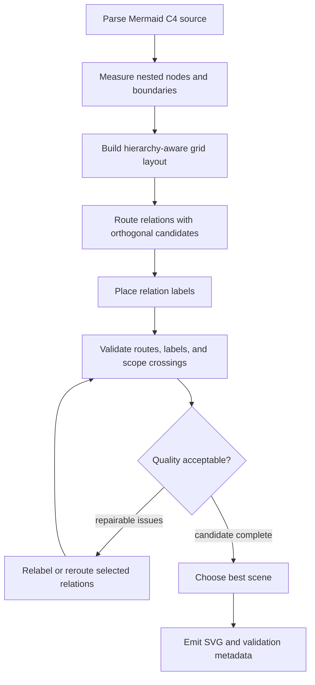

# Rendering Algorithm

This document explains the renderer used by the userscript, with emphasis on the C4 pipeline. Most non-C4 diagram types use smaller, diagram-specific parsers and direct SVG layout. C4 diagrams need a richer pipeline because boundaries, directed relationships, labels, and nested scopes all compete for space.

## Goals

<!-- dagayn: discusses-artifact github-rich-mermaid.user.js::renderC4Component -->

The renderer is built around four constraints:

- It must run inside a Tampermonkey userscript without a server or WASM dependency.
- It must produce deterministic SVG so regressions can be verified.
- It must keep C4 diagrams readable even when relations cross nested boundaries.
- It must fail softly by leaving the original GitHub-rendered block visible when rendering cannot complete.

## Pipeline Overview

<!-- dagayn: discusses-artifact github-rich-mermaid.user.js::selectC4ValidatedScene -->

The C4 renderer follows this sequence:

`renderC4Component` is the entry point. It parses the model, asks `selectC4ValidatedScene` for the best validated layout, renders node and edge layers, and includes validation metadata in the SVG.

## Source Model

<!-- dagayn: discusses-artifact github-rich-mermaid.user.js::parseC4Model -->

`parseC4Model` reads the Mermaid-like function calls used by C4 diagrams. It builds:

- a node map keyed by diagram id,
- a stable node order,
- parent and child links for nested boundaries,
- root-level children,
- relations with source, target, label, technology, direction, and relation tag.

The parser recognizes boundary calls such as `System_Boundary` and `Container_Boundary`, node calls such as `Person`, `Container`, and `ComponentDb`, and directed relations such as `Rel_R`, `Rel_D`, `Rel_L`, and `Rel_U`.

Boundary nesting is tracked with a stack. When a closing brace is read, the current boundary is popped. This gives later stages an explicit tree instead of making layout infer nesting from coordinates.

## Hierarchical Layout

<!-- dagayn: discusses-artifact github-rich-mermaid.user.js::layoutC4Scene -->
<!-- dagayn: discusses-artifact github-rich-mermaid.user.js::buildC4Grid -->

`layoutC4Scene` starts from the root diagram and recursively lays out each boundary. Each boundary is treated as its own grid, so child placement can be solved locally before the parent size is finalized.

The grid builder uses relation direction and node type to derive constraints:

- Right and left relations become horizontal ordering constraints.
- Down and up relations become row ordering constraints.
- Data stores are biased lower than services and components.
- External nodes and people are biased toward the outside of the diagram.

Those constraints are solved as ranks, grouped into rows, and then refined with crossing-reduction passes. Long relations are expanded with temporary virtual nodes so the ordering pass can reserve visual corridors through intermediate rows. After ordering, a relaxation pass nudges nodes toward connected peers while preserving legal row order and required gaps.

Boundary measurement is recursive. Leaf nodes have fixed card widths and text-driven heights. Boundary nodes measure their children first, then add header and padding space. This lets nested systems participate in the parent layout as a single measured box.

## Relation Routing

<!-- dagayn: discusses-artifact github-rich-mermaid.user.js::c4BuildWorkItems -->
<!-- dagayn: discusses-artifact github-rich-mermaid.user.js::routeC4Relation -->

Relations are converted into work items before routing. Each work item stores its allowed region, route hints, source and target port offsets, display label, path length, crossing reservations, and routing state.

The allowed region is normally the canvas. When a relation has a common boundary ancestor, routing is constrained to that boundary's content area. This prevents internal relations from escaping their owning scope.

`routeC4Relation` generates orthogonal route candidates instead of committing to the first available path. Candidate routes include:

- stubs leaving the source and entering the target,
- vertical or horizontal detour axes,
- axes suggested by crossed boundary edges,
- axes shifted away from occupied route segments and obstacles,
- a simple fallback route.

Candidates are scored by path length, bend count, obstacle intersections, segment overlap, route crossings, and whether the route leaves enough room for a label. The lowest-scoring candidate becomes the relation route.

Fan-out and fan-in groups are handled before routing. Related relations receive small port offsets so several arrows can leave or enter the same node without stacking on the same anchor.

## Boundary Crossings

<!-- dagayn: discusses-artifact github-rich-mermaid.user.js::c4BuildRelationCrossingReservations -->

Routes that enter or exit nested boundaries need extra bookkeeping. The renderer computes the expected crossing plan from the source and target ancestor chains, then records lane reservations for the route segments that cross those boundaries.

Validation later compares the planned scope transitions against the actual route. If the route enters or exits through an unexpected side, the scene receives a scope-transition issue and can be repaired or rejected in favor of another candidate.

## Label Placement

<!-- dagayn: discusses-artifact github-rich-mermaid.user.js::c4AssignLabels -->
<!-- dagayn: discusses-artifact github-rich-mermaid.user.js::c4LabelCandidates -->

Label placement is handled after routes exist. For each routed relation, `c4LabelCandidates` scans long route segments and generates possible label rectangles near those segments.

Candidate labels are scored by:

- distance from the segment center,
- offset from the route,
- whether the label fits inside the allowed region,
- clearance from other route segments,
- overlap with node bodies and boundary headers,
- preferred alignment for vertical routes.

`c4AssignLabels` processes higher-priority relations first. Once a label is accepted, the renderer stores an inflated lane rectangle around it. Later labels avoid those reservations, which keeps labels from crowding each other even when their text boxes do not directly overlap.

Vertical relations get an additional preferred-placement pass near the final vertical segment. This improves common top-to-bottom C4 flows where the best label location is close to the arrow head but outside the target node.

## Validation and Repair

<!-- dagayn: discusses-artifact github-rich-mermaid.user.js::c4ValidateScene -->
<!-- dagayn: discusses-artifact github-rich-mermaid.user.js::c4RepairWorkItems -->

The validation scene contains hard rectangles, soft rectangles, label-lane reservations, crossing-lane reservations, occupied route segments, and the routed work items.

Hard issues include missing routes, routes leaving their allowed region, wrong port or arrow-head direction, boundary-header crossings, node-body crossings, route overlaps, route crossings, labels outside their allowed region, labels over hard obstacles, labels crossing foreign routes, and mismatched scope transitions.

Soft issues currently include label-lane overlap and oversized detours. These still affect scene quality, but they carry a smaller penalty than hard failures.

The repair loop runs for a bounded number of iterations. For each problematic relation, it first tries a better label placement. If the issue is route-related or relabeling does not improve the penalty, it reroutes that relation while treating accepted labels as additional obstacles. A change is kept only when the relation penalty improves.

## Scene Selection

<!-- dagayn: discusses-artifact github-rich-mermaid.user.js::c4SceneCandidateBetter -->

After building an initial scene, the renderer derives gap overrides from observed route and label pressure. It can then build a more compact candidate scene and compare it with the initial one.

Candidate comparison prefers:

- fewer hard validation issues,
- lower soft penalty,
- fewer soft issues,
- more placed labels,
- fewer unroutable relations,
- shorter detours and fewer bends,
- useful crossing-lane reservations,
- less wasted canvas area.

The compact scene is selected only when it improves or preserves route quality according to those checks.

## SVG Output

<!-- dagayn: discusses-artifact github-rich-mermaid.user.js::renderC4Node -->
<!-- dagayn: discusses-artifact github-rich-mermaid.user.js::renderC4RelationLabel -->

The final SVG contains:

- metadata with validation issues, repair summary, label-lane count, and crossing-lane count,
- a recursively rendered node layer,
- an edge layer with orthogonal polylines, arrowheads, and relation labels.

Nodes are rendered with C4-specific badges and icons for people, data stores, components, systems, and boundaries. External nodes use dashed outlines. Labels are rendered as plain SVG text so the output remains portable inside GitHub pages.

## Verification

The verifier renders the public gallery and C4 regression scenarios. It checks viewBox stability, deterministic output, routing and label validation, lane reservations, scope-transition mismatches, repair summaries, route detour and bend budgets, canvas waste, same-row spacing, fan-out alignment, route and node avoidance, parallel lane separation, fan-in ordering, collinear overlap prevention, orthogonal routes, canvas bounds, data attributes, and default C4 titles.

Optional Rust parity mode compares supported non-sequence samples with the Docattice renderer for viewBox, text-token parity, and large SVG-shape count drift.
